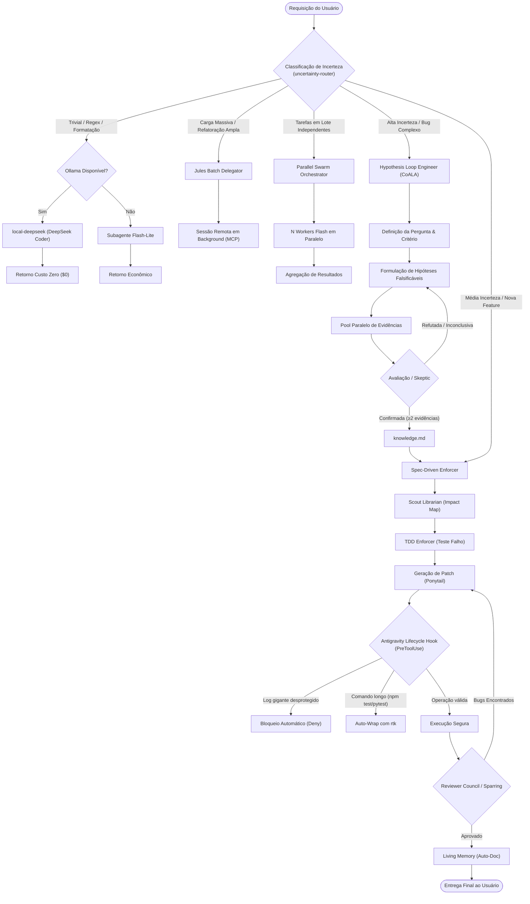
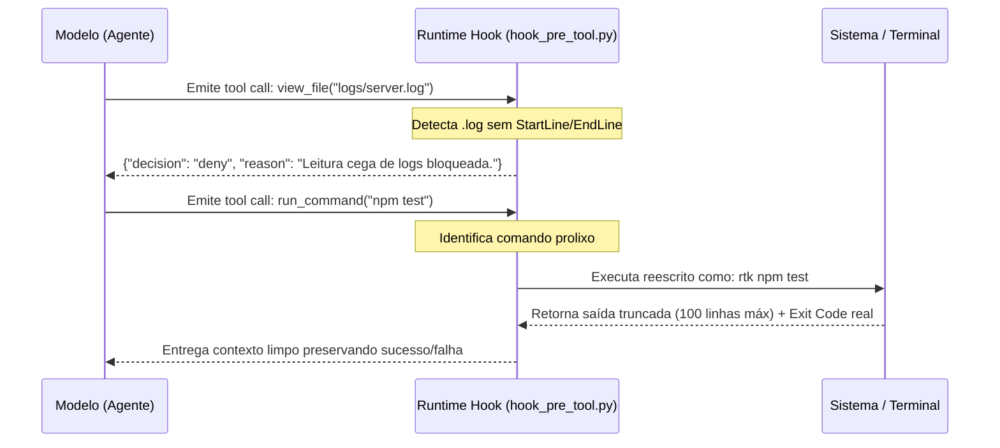
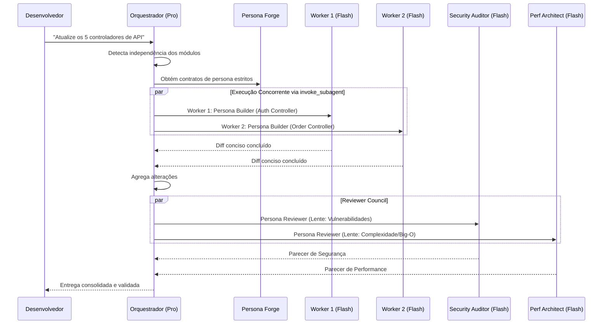
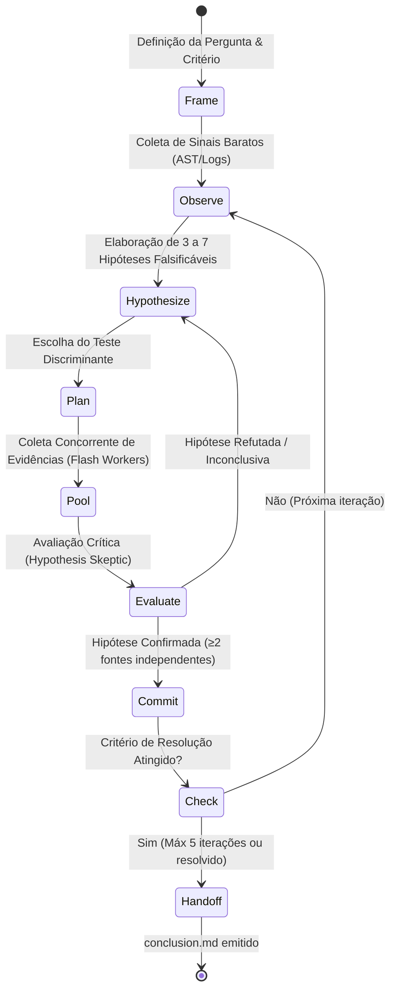

# 🕳️ Event Horizon Skill

<p align="center">
  
</p>

<p align="center">
  <b>Framework determinístico de otimização de tokens, governança de ciclo de vida e orquestração multi-agente para Google Antigravity e modelos de linguagem.</b>
</p>

---

## 📌 Índice

- [Visão Geral & Filosofia](#-visão-geral--filosofia)
- [Arquitetura do Repositório](#-arquitetura-do-repositório)
- [Fluxo Geral do Sistema (Mermaid)](#-fluxo-geral-do-sistema-mermaid)
- [Camada de Governança Determinística (Lifecycle Hooks)](#-camada-de-governança-determinística-lifecycle-hooks)
- [Orquestração Multi-Agente & Swarm](#-orquestração-multi-agente--swarm)
- [Motor de Incerteza & Descoberta: Hypothesis Loop (CoALA)](#-motor-de-incerteza--descoberta-hypothesis-loop-coala)
- [Catálogo Completo de Componentes](#-catálogo-completo-de-componentes)
- [Avaliação & Benchmark Empírico (`eval-harness`)](#-avaliação--benchmark-empírico-eval-harness)
- [Instalação & Configuração](#%EF%B8%8F-instalação--configuração)
- [Jornadas de Uso na Prática](#-jornadas-de-uso-na-prática)
- [Licença](#-licença)

---

## 🧠 Visão Geral & Filosofia

> **Princípio Fundamental: Não pague a IA para fazer trabalho determinístico de CPU.**

Modelos agênticos consomem de 5× a 30× mais tokens do que chats convencionais devido a loops de tentativa e erro, inspeção cega de logs e reescrita integral de arquivos. O **Event Horizon** resolve isso por meio de quatro pilares:

1. **Governança por Código, Não Apenas Prompts:** Intercepção determinística (`hooks.json`) que bloqueia leituras massivas de arquivos e envelopa ferramentas prolixas antes de atingirem o contexto do modelo.
2. **Minimização Cirúrgica de E/S:** Leitura via AST/assinaturas e edição restrita a diffs de linha (`replace_file_content`), erradicando a reescrita de arquivos íntegros.
3. **Estratificação Inteligente de Modelos (Model Tiering):** Roteamento em camadas — tarefas triviais em modelo local gratuito (Ollama / DeepSeek), buscas e parsing em modelos ultrarrápidos/baratos (Flash-Lite / Flash) e raciocínio restrito ao modelo Frontier (Pro).
4. **Resolução de Incerteza Estruturada:** Eliminação de alucinações repetitivas através do ciclo de hipóteses CoALA com testes discriminantes e agentes adversariais.

---

## 🌳 Arquitetura do Repositório

```text
event-horizon-skill/
├── AGENTS.md                        # Contrato global consolidado de disciplina e regras
├── README.md                        # Documentação completa do framework
├── setup.md                         # Guia detalhado de configuração de ambiente
├── hooks.json                       # Definição dos hooks de ciclo de vida do Antigravity
├── LICENSE                          # Licença MIT
├── assets/
│   └── logo.jpg                     # Identidade visual
├── bin/                             # Ferramentas de linha de comando otimizadas
│   ├── rtk                          # Rust Token Killer: trunca logs preservando códigos de saída
│   ├── ast-search                   # Extrator de assinaturas sintáticas (def, class, func)
│   └── local-deepseek               # Roteador HTTP robusto com parser JSON nativo para Ollama
├── scripts/
│   └── hook_pre_tool.py             # Script de validação e overwrite para PreToolUse
├── evals/                           # Suíte empírica de avaliação e benchmarks
│   ├── tasks.json                   # Cenários de teste padronizados para auditoria
│   └── run_evals.py                 # Runner de auditoria de trajetórias e critérios
└── .agents/
    ├── rules/                       # Regras comportamentais declaradas
    │   ├── context-caching.md       # Aproveitamento de cache de prompt estável
    │   ├── flash-lite-sandwich.md   # Delegação de micro-tarefas para modelos leves
    │   ├── json-optimizer.md        # Formatação de saída com chaves concisas
    │   ├── ponytail.md              # Modificação estrita por patches direcionados
    │   ├── stateless-relay.md       # Poda de memória longa via resumos de estado
    │   ├── subagent-routing.md      # Delegação de pesquisas para subagentes Flash
    │   └── uncertainty-router.md    # Roteamento baseado no grau de incerteza da tarefa
    └── skills/                      # Habilidades operacionais e cognitivas
        ├── adversarial-sparring/    # Red-teaming interno antes da entrega
        ├── commit-summarizer/       # Mensagens de commit atômicas em Flash-Lite
        ├── dependency-compiler/     # Mapeamento leve de imports e interfaces
        ├── eval-harness/            # Framework de medição empírica e auditoria
        ├── hypothesis-loop-engineer/# Ciclo CoALA agnóstico (hipótese/evidência/confirmação)
        ├── jules-batch-delegator/   # Despacho assíncrono para sessões MCP Jules
        ├── living-memory/           # Manutenção automática de documentação viva
        ├── local-deepseek-router/   # Execução offline custo zero via Ollama
        ├── log-tailer/              # Leitura restrita com tail e filtros contextuais
        ├── parallel-swarm-orchestrator/# Disparo e agregação de múltiplos subagentes
        ├── persona-forge/           # Contratos formais de papéis (Role Contracts)
        ├── pre-linter/              # Delegação de formatação para linters de CPU
        ├── react-protocol/          # Raciocínio explícito obrigatório antes da ação
        ├── reviewer-council/        # Pareceres concorrentes em segurança e performance
        ├── schema-dumper/           # Extração de DDL de bancos sem poluição de dados
        ├── scout-librarian/         # Mapeamento somente leitura de dependências e impacto
        └── spec-driven-enforcer/    # Especificação obrigatória prévia à implementação
```

---

## 📊 Fluxo Geral do Sistema (Mermaid)

O diagrama a seguir sintetiza o trajeto de qualquer requisição recebida pelo agente, desde a triagem de incerteza até a validação determinística pelos hooks:



---

## 🛡️ Camada de Governança Determinística (Lifecycle Hooks)

Diferente de instruções em texto que o modelo pode ignorar em janelas de contexto saturadas, os **Lifecycle Hooks** operam diretamente no runtime do Antigravity via `hooks.json`.



### Regras Aplicadas pelo Hook (`scripts/hook_pre_tool.py`):
1. **Proteção Contra Leitura Cega de Logs:** Chamadas a `view_file` apontando para arquivos `.log` sem delimitação de linhas são sumariamente negadas, exigindo que o agente use `log-tailer` ou comandos fatiados.
2. **Auto-Encapsulamento com `rtk`:** Comandos que tipicamente geram centenas de linhas de logs (`npm test`, `pytest`, `cargo test`, `go test`) são automaticamente reescritos para rodar via `rtk`, poupando tokens de contexto sem depender da memória do agente.
3. **Bloqueio de Comandos Destrutivos:** Tentativas de deleção ampla (`rm -rf /`, `rm -rf ~`) ou `git push --force` são interceptadas e impedidas.

---

## 🐝 Orquestração Multi-Agente & Swarm

Tarefas que envolvem múltiplos arquivos ou áreas desacopladas não devem ser executadas em filas sequenciais no contexto do modelo principal.



---

## 🔬 Motor de Incerteza & Descoberta: Hypothesis Loop (CoALA)

Para tarefas investigativas onde a causa-raiz ou arquitetura é desconhecida, o modelo não deve "chutar" alterações no código. O **Hypothesis Loop Engineer** implementa o framework cognitivo **CoALA**:



### Tipologia de Evidências:
*   **Estática:** Verificação de contratos e dependências (`ast-search`, `dependency-compiler`, `scout-librarian`).
*   **Dinâmica:** Execução e reprodução por testes controlados (`tdd-enforcer`, `rtk`).
*   **Observacional:** Rastreamento pontual de eventos e métricas (`log-tailer`).
*   **Documental:** Cruzamento com documentações ou fontes históricas (`living-memory`, `search_web`).

---

## 📚 Catálogo Completo de Componentes

| Componente | Tipo | Camada | Objetivo & Mecanismo de Economia |
| :--- | :--- | :--- | :--- |
| **`AGENTS.md`** | Regra Base | Global | Diretrizes consolidadas: Caveman Mode, Ponytail patching e roteamento enxuto. |
| **`hooks.json`** | Runtime | Governança | Intercepção nativa: bloqueio de logs brutos, auto-wrap com `rtk` e portão de segurança. |
| **`bin/rtk`** | CLI | Input | Trunca saídas com mais de 150 linhas preservando estritamente o código de saída original. |
| **`bin/ast-search`** | CLI | Input | Extrai exclusivamente declarações e assinaturas (`class`, `def`, `interface`), economizando até 95% do arquivo. |
| **`bin/local-deepseek`** | CLI | Custo | Wrapper com parser JSON seguro em Python para delegar tarefas ao Ollama local sem custo de API. |
| **`eval-harness`** | Skill + CLI | Medição | Suíte com `evals/run_evals.py` para mensurar trajetórias reais e evitar regressões de tokens. |
| **`ponytail`** | Regra | Output | Obriga edições cirúrgicas por bloco (`replace_file_content`), proibindo reescrita total. |
| **`json-optimizer`** | Regra | Output | Exige estruturas de dados limpas com chaves abreviadas e vetores simplificados. |
| **`stateless-relay`** | Regra | Contexto | Converte longos históricos de conversa em arquivos sintéticos de resumo (`state_summary.txt`). |
| **`context-caching`** | Regra | Contexto | Orientação para reutilização de blocos estáticos de contexto e documentação via cache. |
| **`subagent-routing`** | Regra | Custo | Delega varreduras e leituras amplas a subagentes com modelo Flash. |
| **`flash-lite-sandwich`** | Regra | Custo | Encaminha formatações básicas e regex para a camada mais econômica (`flash-lite`). |
| **`uncertainty-router`** | Regra | Incerteza | Classifica tarefas por risco e incerteza, acionando execução direta, ReAct ou o Hypothesis Loop. |
| **`log-tailer`** | Skill | Input | Proíbe inspeção integral de arquivos `.log`, forçando fatiamento via `tail` ou `grep`. |
| **`schema-dumper`** | Skill | Input | Exporta apenas definições de tabelas e tipos DDL, sem descarregar linhas de dados. |
| **`dependency-compiler`**| Skill | Input | Mapeia grafos de dependência e imports sem carregar os arquivos dependentes. |
| **`pre-linter`** | Skill | Output | Delega alinhamento e regras de estilo a formatadores locais na CPU (Prettier, Black, ESLint). |
| **`commit-summarizer`** | Skill | Custo | Gera mensagens de commit convencionais usando exclusivamente o modelo `flash-lite`. |
| **`local-deepseek-router`**| Skill | Custo | Habilidade que orienta o agente a chamar o wrapper `local-deepseek` para operações offline. |
| **`jules-batch-delegator`**| Skill | Custo | Despacha migrações massivas para a instância do Jules AI via protocolo MCP. |
| **`tdd-enforcer`** | Skill | Qualidade | Garante a criação de testes falhos prévios para guiar a implementação de forma objetiva. |
| **`adversarial-sparring`** | Skill | Qualidade | Submete alterações complexas a um revisor crítico antes de exibi-las ao usuário. |
| **`spec-driven-enforcer`**| Skill | Cognição | Exige a aprovação de uma especificação formal antes do início de codificações de grande porte. |
| **`scout-librarian`** | Skill | Cognição | Cria relatórios de impacto somente leitura antes de alterações em componentes centrais. |
| **`react-protocol`** | Skill | Cognição | Força a declaração de hipóteses e raciocínio antes do disparo de ferramentas. |
| **`living-memory`** | Skill | Memória | Atualiza automaticamente documentações vivas (`CHANGELOG.md`, `ARCHITECTURE.md`). |
| **`parallel-swarm-orchestrator`** | Skill | Multi-Agente | Decompõe demandas em subtarefas paralelas orquestradas por workers em lote. |
| **`reviewer-council`** | Skill | Multi-Agente | Conduz auditorias paralelas com personas especializadas (Segurança vs Performance). |
| **`persona-forge`** | Skill | Multi-Agente | Padroniza contratos de papéis, delimitando escopos, proibições e modelos ideais. |
| **`hypothesis-loop-engineer`** | Skill | Incerteza | Motor agnóstico CoALA para solução metódica de problemas com alta incerteza. |

---

## 📈 Avaliação & Benchmark Empírico (`eval-harness`)

Para substituir hipóteses teóricas por dados verificáveis, o Event Horizon inclui um framework de auditoria baseado na suíte `evals/`:

```bash
# Executar a verificação dos cenários de teste da suíte
python3 evals/run_evals.py
```

### Cenários de Teste Integrados (`evals/tasks.json`):
1. **`eval-01-log-tail` (Compressão de Entrada):** Verifica se o agente evita carregar arquivos de log inteiros ao debugar falhas.
2. **`eval-02-patch-edit` (Compressão de Saída):** Audita se correções pontuais utilizam `replace_file_content` em vez de sobrescrever o arquivo com `write_to_file`.
3. **`eval-03-ast-signature` (Compressão Sintática):** Confirma se a exploração de módulos utiliza `ast-search` para extrair apenas assinaturas.
4. **`eval-04-tdd-verification` (Garantia de Qualidade):** Valida a sequência temporal estrita: teste criado $\rightarrow$ falha confirmada $\rightarrow$ código implementado $\rightarrow$ teste validado.
5. **`eval-05-micro-routing` (Otimização de Custos):** Monitora se tarefas básicas (como geração de regex ou parse de JSON) são roteadas para `flash-lite` ou `local-deepseek`.

---

## ⚙️ Instalação & Configuração

### Pré-requisitos
*   **Google Antigravity:** IDE, CLI ou aplicação desktop instalada.
*   **Ambiente Unix:** macOS ou Linux com `bash` ou `zsh`.
*   **Python 3:** Necessário para o parser local e hooks.
*   **Opcionais:** `ripgrep` (para aceleração do `ast-search`) e `ollama` com `deepseek-coder` (para execução local $0).

### Passo a Passo

```bash
# 1. Clonar o repositório
git clone https://github.com/Helfstein-one/event-horizon-skill.git ~/dev/event-horizon-skill
cd ~/dev/event-horizon-skill

# 2. Instalar e autorizar os executáveis CLI
mkdir -p ~/.local/bin
cp bin/* ~/.local/bin/
chmod +x ~/.local/bin/*
grep -q '.local/bin' ~/.zshrc || echo 'export PATH="$HOME/.local/bin:$PATH"' >> ~/.zshrc

# 3. Vincular regras, hooks e habilidades ao Antigravity Global
mkdir -p ~/.gemini/config/.agents/rules ~/.gemini/config/.agents/skills
cp AGENTS.md ~/.gemini/config/
cp hooks.json ~/.gemini/config/
cp -r scripts ~/.gemini/config/
cp -r .agents/rules/* ~/.gemini/config/.agents/rules/
cp -r .agents/skills/* ~/.gemini/config/.agents/skills/

# 4. (Opcional) Inicializar o servidor DeepSeek local via Ollama
brew install ollama
ollama run deepseek-coder:6.7b
```

---

## 🧭 Jornadas de Uso na Prática

### 1. Investigação de Erro em Ambiente de Execução
```text
"O worker de filas parou de processar mensagens e há erros registrados em logs/worker.log. Descubra o motivo e corrija."
```
*   **Comportamento:** O hook intercepta tentativas de leitura integral do log. O agente utiliza `rtk` e `log-tailer`, identifica o stack trace nas últimas 40 linhas, gera um teste falho reproduzindo o caso (`tdd-enforcer`) e aplica a correção cirúrgica por patch (`ponytail`).

### 2. Desenvolvimento com Especificação Prévia (Spec-Driven)
```text
"Preciso adicionar suporte a webhooks assinados com HMAC-SHA256 na camada de eventos."
```
*   **Comportamento:** O `uncertainty-router` aciona o `spec-driven-enforcer`. O agente elabora a especificação técnica em `.agents/specs/`, valida o impacto de dependências com `scout-librarian`, solicita confirmação do usuário e submete o código final à auditoria do `reviewer-council`.

### 3. Diagnóstico de Incerteza Complexa
```text
"A taxa de requisições com timeout aumentou 30% após o último deploy, mas as métricas de CPU estão normais."
```
*   **Comportamento:** O agente ativa o `hypothesis-loop-engineer`. Elabora três hipóteses concorrentes (contenção de conexões no pool, deadlocks em transações ou latência de DNS). Executa coletores em paralelo com subagentes Flash, refuta as hipóteses incorretas e entrega o arquivo `conclusion.md` com a causa comprovada.

---

## 📄 Licença

Distribuído sob a licença [MIT](./LICENSE).
