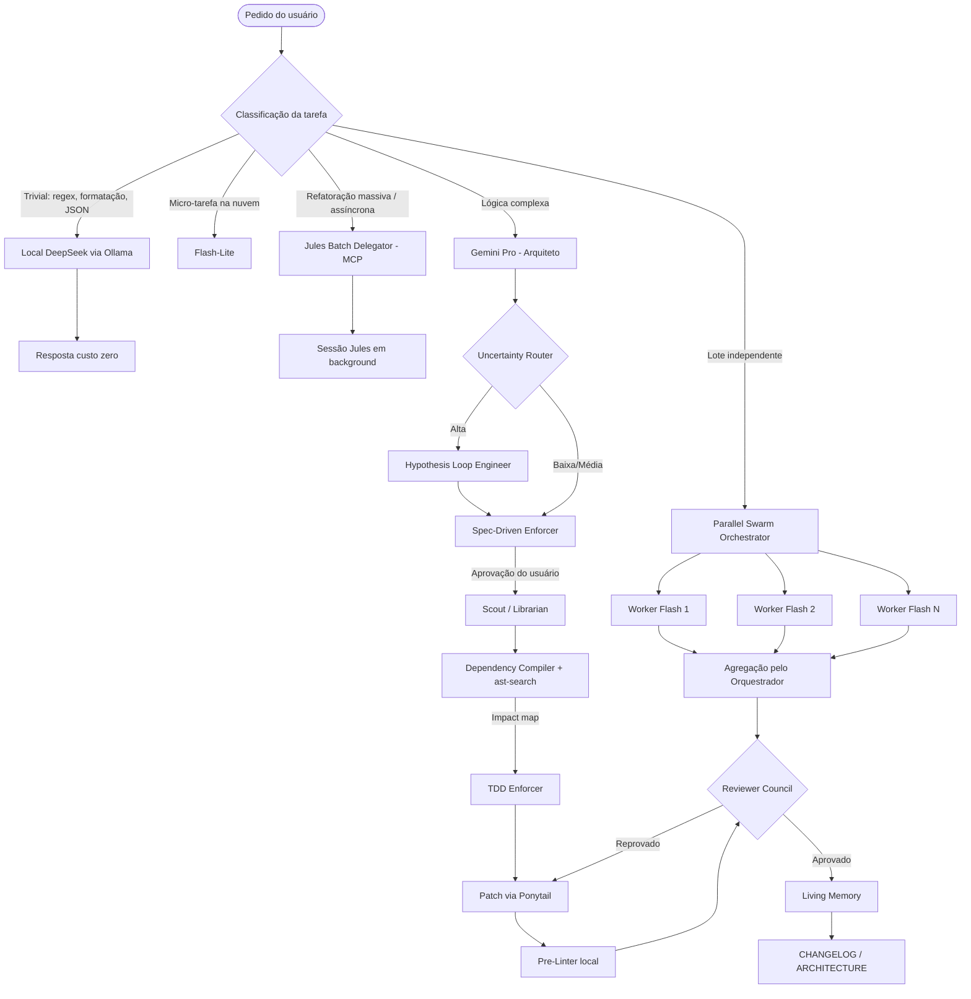
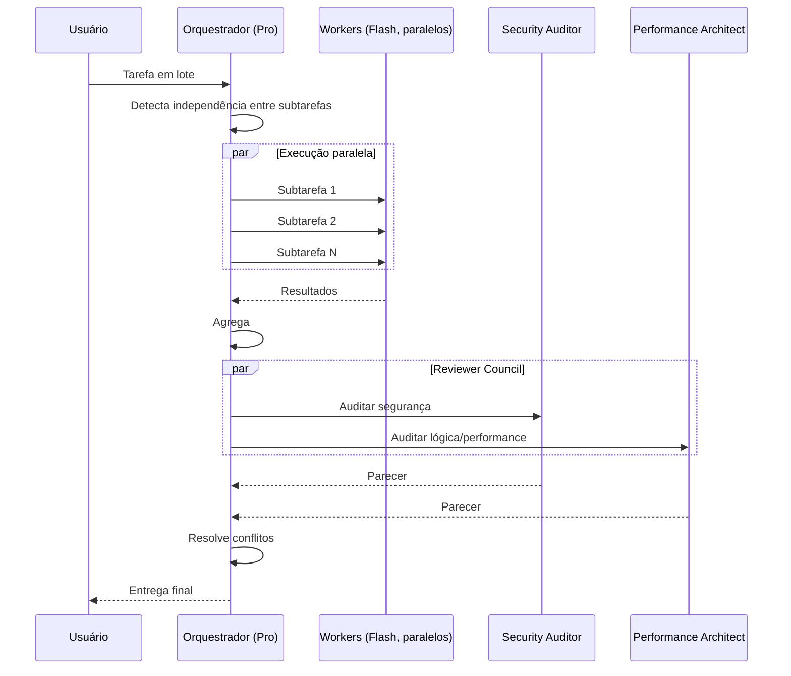
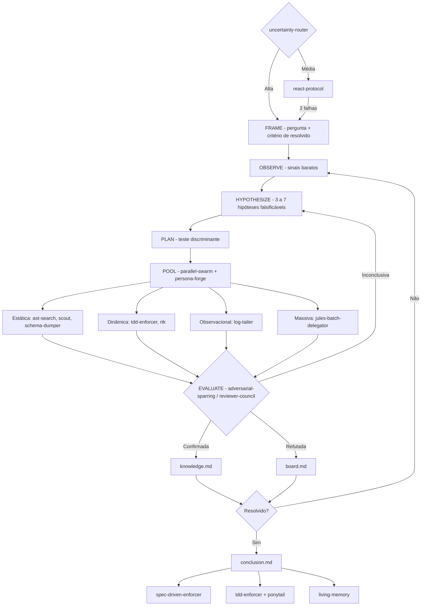

# 🕳️ Event Horizon Skill

<p align="center">
  
</p>

<p align="center">
  <b>Pacote de skills, regras e wrappers CLI para reduzir tokens e aumentar a eficiência de agentes Gemini / Google Antigravity.</b>
</p>

---

## 📌 Índice

- [Filosofia](#-filosofia)
- [Arquitetura do Repositório](#-arquitetura-do-repositório)
- [Diagrama de Fluxo](#-diagrama-de-fluxo)
- [Arquitetura Multi-Agente (Swarm)](#-arquitetura-multi-agente-swarm)
- [Hypothesis Loop Engineer (CoALA)](#-hypothesis-loop-engineer-coala)
- [Catálogo Completo](#-catálogo-completo)
- [Benchmark](#-benchmark)
- [Instalação](#%EF%B8%8F-instalação)
- [Jornadas de Uso](#-jornadas-de-uso)
- [Licença](#-licença)

---

## 🧠 Filosofia

> **Não pague a IA para fazer trabalho de CPU.**

1. **Ler menos** → comprimir input (logs, dependências, schemas).
2. **Escrever menos** → patches em vez de arquivos inteiros, zero conversa.
3. **Pensar no modelo certo** → Pro só para arquitetura; Flash/Flash-Lite/local para o resto.
4. **Errar menos** → TDD, specs e revisores evitam loops de retrabalho (o maior desperdício real).
5. **Paralelizar** → tarefas independentes rodam em swarm, não em fila.

---

## 🌳 Arquitetura do Repositório

```text
event-horizon-skill/
├── AGENTS.md                        # Regra global: Caveman Mode
├── README.md
├── setup.md                         # Guia de instalação
├── assets/
│   └── logo.jpg
├── bin/                             # Wrappers CLI (compressão de input)
│   ├── rtk                          # Trunca saídas > 150 linhas (head/tail 50)
│   ├── ast-search                   # Extrai só assinaturas (def/class/function/type)
│   └── local-deepseek               # Envia prompt ao Ollama local (deepseek-coder)
└── .agents/
    ├── rules/                       # Regras sempre ativas
    │   ├── ponytail.md              # Patch-only
    │   ├── subagent-routing.md      # Pesquisa → subagente Flash
    │   ├── flash-lite-sandwich.md   # Micro-tarefas → Flash-Lite
    │   ├── stateless-relay.md       # Poda de contexto com state_summary
    │   ├── json-optimizer.md        # JSON com chaves curtas
    │   ├── context-caching.md       # Reuso de contexto estático
    │   └── uncertainty-router.md    # Direto / ReAct / Hypothesis Loop
    └── skills/                      # Skills sob demanda
        ├── log-tailer/              # Input
        ├── schema-dumper/           # Input
        ├── dependency-compiler/     # Input
        ├── pre-linter/              # Output
        ├── commit-summarizer/       # Custo
        ├── local-deepseek-router/   # Custo
        ├── jules-batch-delegator/   # Custo (MCP Jules)
        ├── tdd-enforcer/            # Qualidade
        ├── adversarial-sparring/    # Qualidade
        ├── spec-driven-enforcer/    # Cognição
        ├── scout-librarian/         # Cognição
        ├── react-protocol/          # Cognição
        ├── living-memory/           # Memória
        ├── parallel-swarm-orchestrator/  # Multi-agente
        ├── reviewer-council/        # Multi-agente
        ├── persona-forge/           # Multi-agente (papéis)
        └── hypothesis-loop-engineer/ # Motor de incerteza (CoALA)
```

---

## 📊 Diagrama de Fluxo



---

## 🐝 Arquitetura Multi-Agente (Swarm)



| Papel | Modelo | Responsabilidade |
| :--- | :--- | :--- |
| Orquestrador | Pro | Decompor, decidir paralelismo, agregar, resolver conflitos |
| Workers | Flash | Executar subtarefas independentes em paralelo |
| Security Auditor | Flash | Vulnerabilidades, edge cases |
| Performance Architect | Flash | Complexidade, clareza, eficiência |

### 🎭 Personas (`persona-forge`)

Cada subagente recebe um **contrato de papel** (missão, escopo, proibições, método, saída, limite). Personas core são agnósticas; personas de domínio são derivadas sob demanda.

| Persona core | Modelo | Papel |
| :--- | :--- | :--- |
| Orchestrator | Pro | Decompõe, atribui personas, decide |
| Scout | Flash | Mapeia terreno e impacto |
| Evidence Collector | Flash-Lite | Coleta fatos para uma hipótese |
| Skeptic | Flash | Tenta refutar |
| Synthesizer | Flash | Consolida achados |
| Strategist | Pro | Abordagem, fases, riscos |
| Test Designer | Flash | Critérios de aceitação/testes |
| Builder | Flash | Patches do plano aprovado |
| Reviewer | Flash | Revisão sob uma lente |

| Padrão | Composição |
| :--- | :--- |
| Investigar | Orchestrator → Scout → Evidence Collector ×N → Skeptic → Synthesizer |
| Construir | Orchestrator → Strategist → Test Designer → Builder → Reviewer |
| Revisar | Orchestrator → Reviewer ×N (lentes) → Synthesizer |
| Lote | Orchestrator → Builder ×N → Reviewer |

---

## 🔬 Hypothesis Loop Engineer (CoALA)

**Motor de incerteza** do pacote, agnóstico de domínio. Baseado em **CoALA** (*Cognitive Architectures for Language Agents*). Princípio: *nenhuma ação relevante sobre suposição* — toda suposição vira hipótese falsificável, testada com a evidência mais barata, e só vira fato após confirmação.

Serve para qualquer tarefa com incerteza alta: bug sem causa clara, regressão de performance, incidente, decisão de arquitetura, codebase ou sistema desconhecido, pesquisa técnica, comportamento inesperado de dados ou de produto.

### Quando entra em ação (`uncertainty-router`)

| Incerteza | Modo |
| :--- | :--- |
| Baixa | Agir direto (`ponytail`) |
| Média | `react-protocol` |
| Alta / ≥2 explicações / erro caro | `hypothesis-loop-engineer` |
| Requisito ambíguo | `ask_question` → `spec-driven-enforcer` |

`react-protocol` escala para o loop após 2 hipóteses falhas.

### Ciclo e integração



| Memória CoALA | Arquivo |
| :--- | :--- |
| Working | `.agents/loops/<slug>/board.md` |
| Episodic | `.agents/loops/<slug>/log.md` |
| Semantic | `.agents/loops/<slug>/knowledge.md` |
| Procedural | skills + `bin/*` |

| Tipo de evidência | Ferramentas |
| :--- | :--- |
| Estática | `ast-search`, `dependency-compiler`, `scout-librarian`, `schema-dumper` |
| Dinâmica | `tdd-enforcer`, `run_command` + `rtk` |
| Observacional | `log-tailer`, `rtk` |
| Documental | `living-memory`, `search_web` |
| Humana | `ask_question` |

**Confirmação:** ≥2 evidências independentes de tipos diferentes, nenhuma contrária, confiança ≥ 0.8.
**Saída:** critério do FRAME atingido, 5 iterações, ou 2 iterações sem fato novo (pergunta ao usuário).

---

## 📚 Catálogo Completo

| Componente | Tipo | Camada | Mecanismo de economia |
| :--- | :--- | :--- | :--- |
| Caveman (`AGENTS.md`) | Regra | Output | Elimina texto conversacional |
| Ponytail | Regra | Output | Edita só linhas alteradas |
| JSON Optimizer | Regra | Output | Chaves curtas, menos estrutura |
| Pre-Linter | Skill | Output | Formatação feita pela CPU |
| RTK (`bin/rtk`) | CLI | Input | Trunca saídas longas |
| Log Tailer | Skill | Input | `tail`/`grep` em vez de ler logs inteiros |
| AST Search (`bin/ast-search`) | CLI | Input | Só assinaturas |
| Dependency Compiler | Skill | Input | Mapa de dependências sem ler arquivos |
| Schema Dumper | Skill | Input | Schema sem dados |
| Stateless Relay | Regra | Input | Resumo de estado em vez de histórico |
| Context Caching | Regra | Input | Reuso de contexto estático |
| Subagent Routing | Regra | Custo | Pesquisa em Flash |
| Flash-Lite Sandwich | Regra | Custo | Micro-tarefas em Flash-Lite |
| Local DeepSeek Router | Skill + CLI | Custo | Tarefas triviais no Ollama local |
| Commit Summarizer | Skill | Custo | Commits via Flash-Lite |
| Jules Batch Delegator | Skill | Custo | Trabalho pesado assíncrono via MCP |
| TDD Enforcer | Skill | Qualidade | Menos tentativa-e-erro |
| Adversarial Sparring | Skill | Qualidade | Auto-revisão antes da entrega |
| Spec-Driven Enforcer | Skill | Cognição | Plano aprovado antes de codar |
| Scout / Librarian | Skill | Cognição | Mapa de impacto antes de editar |
| ReAct Protocol | Skill | Cognição | Hipótese antes de agir |
| Living Memory | Skill | Memória | Docs atualizados = menos releitura futura |
| Parallel Swarm Orchestrator | Skill | Multi-agente | Paralelismo com workers Flash |
| Reviewer Council | Skill | Multi-agente | Revisão especializada concorrente |
| Persona Forge | Skill | Multi-agente | Papéis com escopo e saída fixos = menos ruído entre agentes |
| Hypothesis Loop Engineer | Skill | Incerteza | Teste discriminante elimina várias hipóteses por vez; fatos confirmados nunca são reinvestigados |
| Uncertainty Router | Regra | Incerteza | Escolhe o modo mais barato: direto, ReAct ou loop |

---

## 📈 Benchmark

> [!IMPORTANT]
> Os números abaixo são **estimativas de projeto** baseadas em cenários típicos e em relatos públicos — **não** são medições controladas deste repositório. Resultados reais variam conforme projeto, modelo e estilo de uso. Uma análise independente (JetBrains, 2026) mediu ganho de apenas **~8–10%** para modos tipo Caveman isolados em fluxos agênticos, porque a maior parte do output já é código/tool calls. Os ganhos maiores vêm de **input**, **roteamento de modelo** e **menos retrabalho**.

### Por operação (estimado)

| Operação | Sem pacote | Com pacote | Redução |
| :--- | ---: | ---: | ---: |
| Ler log de 15k linhas | ~150k tokens | ~1–2k (`rtk` / `tail`) | ~99% |
| Entender 10 arquivos importados | ~15–20k | ~0.5–1k (`ast-search`) | ~95% |
| Editar 3 linhas num arquivo de 800 | ~8k output | ~300 output (patch) | ~95% |
| Inspecionar banco de dados | ~10k+ (linhas) | ~1k (schema) | ~90% |
| Mensagem de commit | Pro | Flash-Lite | custo ~-95% |
| Regex / formatação JSON | Pro | Ollama local | custo $0 |
| Refatorar 50 arquivos | ~1–2M síncrono | ~200 (despacho MCP) | ~99% local |
| Resposta conversacional | ~300–800 | ~50–150 | ~70–80% (texto) |

### Por fluxo (estimado)

| Métrica | Sem pacote | Com pacote |
| :--- | ---: | ---: |
| Tokens/dia (uso intenso) | ~2.5M | ~250–400k |
| Tentativas até código funcional | 3–5 | 1–2 |
| Tempo em lote de 5 tarefas independentes | 5× sequencial | ~1× (paralelo) |
| Fração de trabalho rodando em Pro | ~100% | ~20–30% |

### Como medir no seu ambiente

1. Escolha 3–5 tarefas reais e repetíveis (ex: corrigir bug, adicionar teste, refatorar módulo).
2. Rode cada uma **sem** as regras (renomeie `~/.gemini/config/.agents`) e anote tokens/custo do painel de uso.
3. Restaure as regras e rode as mesmas tarefas.
4. Compare: tokens de input, tokens de output, número de turnos e custo.

> [!TIP]
> Contribua com seus resultados via issue/PR para substituir as estimativas por dados medidos.

---

## ⚙️ Instalação

Guia detalhado (Ollama, MCP do Jules) em **[setup.md](./setup.md)**.

### Pré-requisitos

| Requisito | Obrigatório | Usado por |
| :--- | :---: | :--- |
| Google Antigravity (IDE, CLI ou App) | ✅ | Todas as regras/skills |
| `git`, `bash`/`zsh` | ✅ | Instalação, wrappers |
| `ripgrep` (`brew install ripgrep`) | Recomendado | `ast-search` (usa `grep` como fallback) |
| Ollama + `deepseek-coder` | Opcional | `local-deepseek-router` |
| Jules MCP configurado | Opcional | `jules-batch-delegator` |

### Opção A — Instalação global completa (todas as skills, todos os projetos)

```bash
git clone https://github.com/Helfstein-one/event-horizon-skill.git
cd event-horizon-skill

# 1. Backup da config existente
[ -d ~/.gemini/config ] && cp -r ~/.gemini/config ~/.gemini/config.bak-$(date +%s)

# 2. Wrappers CLI
mkdir -p ~/.local/bin && cp bin/* ~/.local/bin/ && chmod +x ~/.local/bin/*
grep -q '.local/bin' ~/.zshrc || echo 'export PATH="$HOME/.local/bin:$PATH"' >> ~/.zshrc

# 3. Regras e skills globais
mkdir -p ~/.gemini/config/.agents
cp AGENTS.md ~/.gemini/config/
cp -r .agents/rules .agents/skills ~/.gemini/config/.agents/
```

Reinicie o Antigravity.

### Opção B — Por projeto (versionado com o time)

```bash
cd /caminho/do/seu-projeto
git clone --depth 1 https://github.com/Helfstein-one/event-horizon-skill.git /tmp/ehs
mkdir -p .agents
cp -r /tmp/ehs/.agents/rules /tmp/ehs/.agents/skills .agents/
cp /tmp/ehs/AGENTS.md ./AGENTS.md
git add .agents AGENTS.md && git commit -m "chore: add event-horizon skills"
```

Skills de workspace têm **prioridade** sobre as globais.

### Opção C — À la carte (só o que você precisa)

```bash
# Exemplo: só economia de input + TDD
mkdir -p ~/.gemini/config/.agents/skills
for s in log-tailer dependency-compiler schema-dumper tdd-enforcer; do
  cp -r .agents/skills/$s ~/.gemini/config/.agents/skills/
done
```

Para regras: copie arquivos individuais de `.agents/rules/` para `~/.gemini/config/.agents/rules/`.

### Verificar instalação

```bash
ls ~/.gemini/config/.agents/skills ~/.gemini/config/.agents/rules
which rtk ast-search local-deepseek
rtk ls -la /usr/bin            # deve truncar a saída
ast-search ./src               # lista só assinaturas
local-deepseek "diga ok"       # requer Ollama rodando
```

No chat do Antigravity, pergunte: *"quais skills você tem disponíveis?"* — as skills do pacote devem aparecer.

### Desinstalar

```bash
rm -rf ~/.gemini/config/.agents/rules/{ponytail,subagent-routing,flash-lite-sandwich,stateless-relay,json-optimizer,context-caching,uncertainty-router}.md
cd ~/.gemini/config/.agents/skills && rm -rf log-tailer schema-dumper dependency-compiler pre-linter \
  commit-summarizer local-deepseek-router jules-batch-delegator tdd-enforcer adversarial-sparring \
  spec-driven-enforcer scout-librarian react-protocol living-memory parallel-swarm-orchestrator reviewer-council \
  persona-forge hypothesis-loop-engineer
rm -f ~/.local/bin/{rtk,ast-search,local-deepseek}
rm -f ~/.gemini/config/AGENTS.md   # ou restaure o backup
```

> [!WARNING]
> `AGENTS.md` sobrescreve um `AGENTS.md` existente. Sempre faça backup antes.

---

## 🧭 Jornadas de Uso

Exemplos de prompts e quais componentes entram em ação. Você não precisa chamar as skills pelo nome — as regras `always_on` e as descrições das skills fazem o roteamento. Citar o nome força a ativação.

### 1. 🐛 Debugar um erro em produção

> *"O endpoint /checkout está retornando 500. Investigue os logs em `logs/api.log` e corrija."*

| Etapa | Componente |
| :--- | :--- |
| Lê só o trecho relevante do log | `log-tailer`, `rtk` |
| Formula hipótese antes de agir | `react-protocol` |
| Mapeia quem chama a função quebrada | `scout-librarian`, `ast-search` |
| Cria teste que reproduz o bug | `tdd-enforcer` |
| Corrige com patch mínimo | `ponytail` |
| Registra a correção | `living-memory` |

### 2. ✨ Construir uma feature nova

> *"Adicione autenticação por magic link. Use spec-driven-enforcer."*

| Etapa | Componente |
| :--- | :--- |
| Gera spec em `.agents/specs/` e pede aprovação | `spec-driven-enforcer` |
| Mapeia impacto nos módulos existentes | `scout-librarian`, `dependency-compiler` |
| Testes primeiro | `tdd-enforcer` |
| Implementação em patches + formatação local | `ponytail`, `pre-linter` |
| Revisão de segurança e lógica em paralelo | `reviewer-council` |
| Commit barato | `commit-summarizer` |

### 3. 🏗️ Refatoração massiva

> *"Migre todo o projeto de JavaScript para TypeScript."*

| Etapa | Componente |
| :--- | :--- |
| Detecta que é pesado/assíncrono | `jules-batch-delegator` |
| Cria sessão no Jules via MCP | MCP `google-jules` |
| Agente local fica livre | — |

### 4. 📦 Tarefas em lote independentes

> *"Escreva testes unitários para os 8 componentes em `src/components/`."*

| Etapa | Componente |
| :--- | :--- |
| Detecta independência entre arquivos | `parallel-swarm-orchestrator` |
| Dispara N workers Flash em paralelo | `invoke_subagent` (array) |
| Agrega e revisa | `adversarial-sparring` |

### 5. 🗄️ Trabalhar com banco de dados

> *"Crie uma query que retorne os clientes inativos há 90 dias."*

| Etapa | Componente |
| :--- | :--- |
| Lê só o schema, sem dados | `schema-dumper` |
| Gera SQL | Pro (ou `local-deepseek` se trivial) |
| Resposta em JSON enxuto | `json-optimizer` |

### 6. 🔧 Micro-tarefas do dia a dia

> *"Crie um regex para validar CPF."* / *"Formate este JSON."*

| Etapa | Componente |
| :--- | :--- |
| Roteia para modelo local (custo zero) | `local-deepseek-router` |
| Fallback em nuvem barata | `flash-lite-sandwich` |

### 7. 🔍 Onboarding em codebase desconhecida

> *"Explique a arquitetura deste repositório."*

| Etapa | Componente |
| :--- | :--- |
| Delega leitura para subagente Flash | `subagent-routing` |
| Lê só assinaturas | `ast-search`, `dependency-compiler` |
| Gera/atualiza `ARCHITECTURE.md` | `living-memory` |

### 8. ⏳ Sessões longas

> Conversa com dezenas de iterações.

| Etapa | Componente |
| :--- | :--- |
| Após ~5 iterações, grava `state_summary.txt` | `stateless-relay` |
| Continua a partir do resumo, não do histórico | `stateless-relay`, `context-caching` |

### 9. 🔬 Investigar qualquer incerteza

> *"A API ficou 40% mais lenta depois do último deploy e ninguém sabe por quê."*
> *"Devemos usar fila ou cron para este processamento? Investigue."*
> *"Este teste falha só no CI."*

| Etapa | Componente |
| :--- | :--- |
| Classifica como incerteza alta | `uncertainty-router` |
| Define pergunta + critério de resolvido | `hypothesis-loop-engineer` (FRAME) |
| Gera hipóteses concorrentes e teste discriminante | `hypothesis-loop-engineer` |
| Coleta paralela, 1 persona por hipótese | `parallel-swarm-orchestrator` + `persona-forge` |
| Evidência estática / dinâmica / observacional | `ast-search`, `tdd-enforcer`, `log-tailer`, `rtk` |
| Tenta refutar | `adversarial-sparring` / `reviewer-council` |
| Memória em arquivo, não no chat | `stateless-relay` |
| Conclusão → ação | `spec-driven-enforcer` ou `tdd-enforcer` + `ponytail` |
| Fatos duráveis → docs | `living-memory` |

### Escolha rápida por perfil

| Perfil | Instale |
| :--- | :--- |
| **Econômico** (menos tokens) | Caveman, Ponytail, RTK, Log Tailer, AST Search, Flash-Lite Sandwich |
| **Qualidade** (menos bugs) | TDD, Adversarial Sparring, Spec-Driven, Reviewer Council |
| **Velocidade** (paralelismo) | Parallel Swarm, Subagent Routing, Jules Delegator |
| **Investigação / incerteza** | Uncertainty Router, Hypothesis Loop Engineer, Persona Forge, Scout, AST Search, Log Tailer |
| **Privacidade / offline** | Local DeepSeek Router + Ollama |
| **Tudo** | Opção A |

---

## 📄 Licença

[MIT](./LICENSE)
