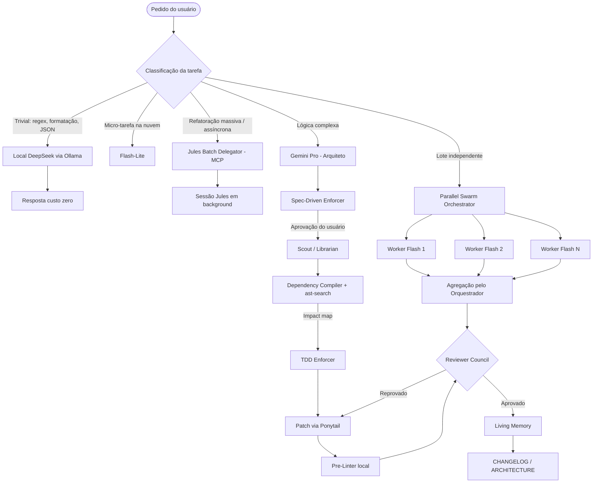
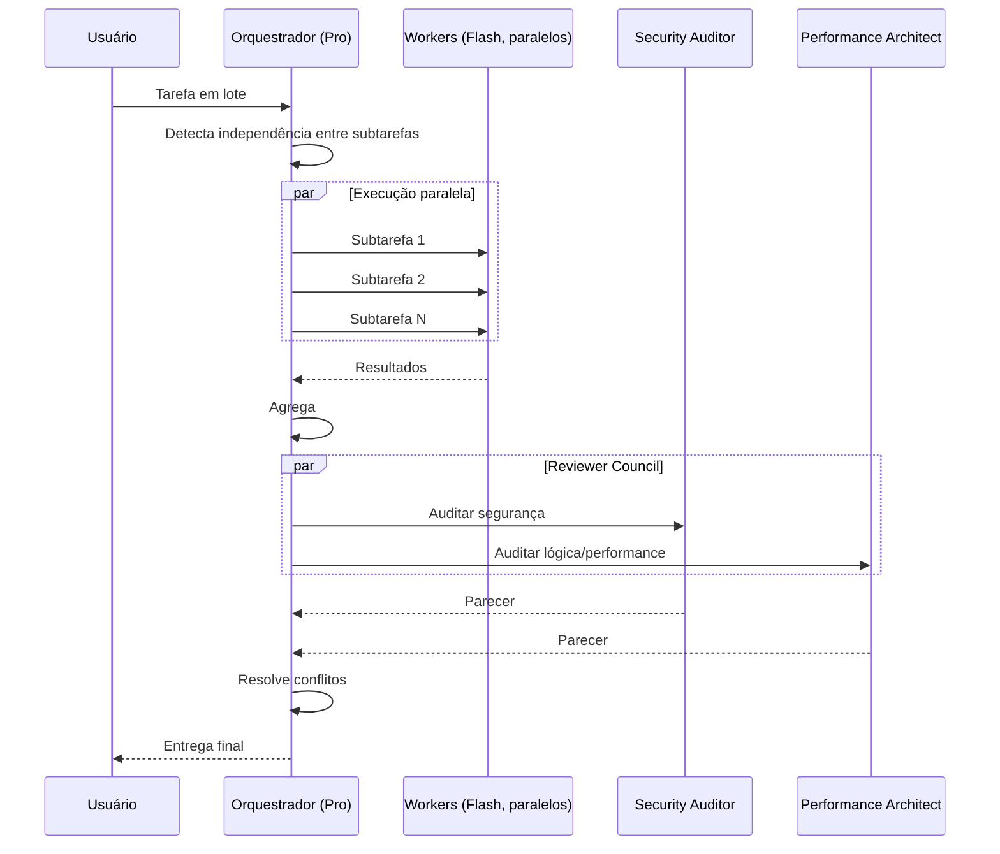

# 🕳️ Event Horizon Skill

<p align="center">
  
</p>

<p align="center">
  <b>Pacote de skills, regras e wrappers CLI para reduzir tokens e aumentar a eficiência de agentes Gemini / Google Antigravity.</b>
</p>

---

## 📌 Índice

- [Filosofia](#-filosofia)
- [Arquitetura do Repositório](#-arquitetura-do-repositório)
- [Diagrama de Fluxo](#-diagrama-de-fluxo)
- [Arquitetura Multi-Agente (Swarm)](#-arquitetura-multi-agente-swarm)
- [Catálogo Completo](#-catálogo-completo)
- [Benchmark](#-benchmark)
- [Setup](#%EF%B8%8F-setup)

---

## 🧠 Filosofia

> **Não pague a IA para fazer trabalho de CPU.**

1. **Ler menos** → comprimir input (logs, dependências, schemas).
2. **Escrever menos** → patches em vez de arquivos inteiros, zero conversa.
3. **Pensar no modelo certo** → Pro só para arquitetura; Flash/Flash-Lite/local para o resto.
4. **Errar menos** → TDD, specs e revisores evitam loops de retrabalho (o maior desperdício real).
5. **Paralelizar** → tarefas independentes rodam em swarm, não em fila.

---

## 🌳 Arquitetura do Repositório

```text
event-horizon-skill/
├── AGENTS.md                        # Regra global: Caveman Mode
├── README.md
├── setup.md                         # Guia de instalação
├── assets/
│   └── logo.jpg
├── bin/                             # Wrappers CLI (compressão de input)
│   ├── rtk                          # Trunca saídas > 150 linhas (head/tail 50)
│   ├── ast-search                   # Extrai só assinaturas (def/class/function/type)
│   └── local-deepseek               # Envia prompt ao Ollama local (deepseek-coder)
└── .agents/
    ├── rules/                       # Regras sempre ativas
    │   ├── ponytail.md              # Patch-only
    │   ├── subagent-routing.md      # Pesquisa → subagente Flash
    │   ├── flash-lite-sandwich.md   # Micro-tarefas → Flash-Lite
    │   ├── stateless-relay.md       # Poda de contexto com state_summary
    │   ├── json-optimizer.md        # JSON com chaves curtas
    │   └── context-caching.md       # Reuso de contexto estático
    └── skills/                      # Skills sob demanda
        ├── log-tailer/              # Input
        ├── schema-dumper/           # Input
        ├── dependency-compiler/     # Input
        ├── pre-linter/              # Output
        ├── commit-summarizer/       # Custo
        ├── local-deepseek-router/   # Custo
        ├── jules-batch-delegator/   # Custo (MCP Jules)
        ├── tdd-enforcer/            # Qualidade
        ├── adversarial-sparring/    # Qualidade
        ├── spec-driven-enforcer/    # Cognição
        ├── scout-librarian/         # Cognição
        ├── react-protocol/          # Cognição
        ├── living-memory/           # Memória
        ├── parallel-swarm-orchestrator/  # Multi-agente
        └── reviewer-council/        # Multi-agente
```

---

## 📊 Diagrama de Fluxo



---

## 🐝 Arquitetura Multi-Agente (Swarm)



| Papel | Modelo | Responsabilidade |
| :--- | :--- | :--- |
| Orquestrador | Pro | Decompor, decidir paralelismo, agregar, resolver conflitos |
| Workers | Flash | Executar subtarefas independentes em paralelo |
| Security Auditor | Flash | Vulnerabilidades, edge cases |
| Performance Architect | Flash | Complexidade, clareza, eficiência |

---

## 📚 Catálogo Completo

| Componente | Tipo | Camada | Mecanismo de economia |
| :--- | :--- | :--- | :--- |
| Caveman (`AGENTS.md`) | Regra | Output | Elimina texto conversacional |
| Ponytail | Regra | Output | Edita só linhas alteradas |
| JSON Optimizer | Regra | Output | Chaves curtas, menos estrutura |
| Pre-Linter | Skill | Output | Formatação feita pela CPU |
| RTK (`bin/rtk`) | CLI | Input | Trunca saídas longas |
| Log Tailer | Skill | Input | `tail`/`grep` em vez de ler logs inteiros |
| AST Search (`bin/ast-search`) | CLI | Input | Só assinaturas |
| Dependency Compiler | Skill | Input | Mapa de dependências sem ler arquivos |
| Schema Dumper | Skill | Input | Schema sem dados |
| Stateless Relay | Regra | Input | Resumo de estado em vez de histórico |
| Context Caching | Regra | Input | Reuso de contexto estático |
| Subagent Routing | Regra | Custo | Pesquisa em Flash |
| Flash-Lite Sandwich | Regra | Custo | Micro-tarefas em Flash-Lite |
| Local DeepSeek Router | Skill + CLI | Custo | Tarefas triviais no Ollama local |
| Commit Summarizer | Skill | Custo | Commits via Flash-Lite |
| Jules Batch Delegator | Skill | Custo | Trabalho pesado assíncrono via MCP |
| TDD Enforcer | Skill | Qualidade | Menos tentativa-e-erro |
| Adversarial Sparring | Skill | Qualidade | Auto-revisão antes da entrega |
| Spec-Driven Enforcer | Skill | Cognição | Plano aprovado antes de codar |
| Scout / Librarian | Skill | Cognição | Mapa de impacto antes de editar |
| ReAct Protocol | Skill | Cognição | Hipótese antes de agir |
| Living Memory | Skill | Memória | Docs atualizados = menos releitura futura |
| Parallel Swarm Orchestrator | Skill | Multi-agente | Paralelismo com workers Flash |
| Reviewer Council | Skill | Multi-agente | Revisão especializada concorrente |

---

## 📈 Benchmark

> [!IMPORTANT]
> Os números abaixo são **estimativas de projeto** baseadas em cenários típicos e em relatos públicos — **não** são medições controladas deste repositório. Resultados reais variam conforme projeto, modelo e estilo de uso. Uma análise independente (JetBrains, 2026) mediu ganho de apenas **~8–10%** para modos tipo Caveman isolados em fluxos agênticos, porque a maior parte do output já é código/tool calls. Os ganhos maiores vêm de **input**, **roteamento de modelo** e **menos retrabalho**.

### Por operação (estimado)

| Operação | Sem pacote | Com pacote | Redução |
| :--- | ---: | ---: | ---: |
| Ler log de 15k linhas | ~150k tokens | ~1–2k (`rtk` / `tail`) | ~99% |
| Entender 10 arquivos importados | ~15–20k | ~0.5–1k (`ast-search`) | ~95% |
| Editar 3 linhas num arquivo de 800 | ~8k output | ~300 output (patch) | ~95% |
| Inspecionar banco de dados | ~10k+ (linhas) | ~1k (schema) | ~90% |
| Mensagem de commit | Pro | Flash-Lite | custo ~-95% |
| Regex / formatação JSON | Pro | Ollama local | custo $0 |
| Refatorar 50 arquivos | ~1–2M síncrono | ~200 (despacho MCP) | ~99% local |
| Resposta conversacional | ~300–800 | ~50–150 | ~70–80% (texto) |

### Por fluxo (estimado)

| Métrica | Sem pacote | Com pacote |
| :--- | ---: | ---: |
| Tokens/dia (uso intenso) | ~2.5M | ~250–400k |
| Tentativas até código funcional | 3–5 | 1–2 |
| Tempo em lote de 5 tarefas independentes | 5× sequencial | ~1× (paralelo) |
| Fração de trabalho rodando em Pro | ~100% | ~20–30% |

### Como medir no seu ambiente

1. Escolha 3–5 tarefas reais e repetíveis (ex: corrigir bug, adicionar teste, refatorar módulo).
2. Rode cada uma **sem** as regras (renomeie `~/.gemini/config/.agents`) e anote tokens/custo do painel de uso.
3. Restaure as regras e rode as mesmas tarefas.
4. Compare: tokens de input, tokens de output, número de turnos e custo.

> [!TIP]
> Contribua com seus resultados via issue/PR para substituir as estimativas por dados medidos.

---

## ⚙️ Setup

Guia completo em **[setup.md](./setup.md)**. Resumo:

```bash
git clone https://github.com/Helfstein-one/event-horizon-skill.git
cd event-horizon-skill

# CLI wrappers
mkdir -p ~/.local/bin && cp bin/* ~/.local/bin/ && chmod +x ~/.local/bin/*

# Regras e skills globais do Antigravity
mkdir -p ~/.gemini/config/.agents
cp AGENTS.md ~/.gemini/config/
cp -r .agents/rules .agents/skills ~/.gemini/config/.agents/

# Opcional: modelo local
brew install ollama && ollama pull deepseek-coder
```

> [!WARNING]
> `AGENTS.md` sobrescreve um `AGENTS.md` global existente. Faça backup antes.

---

## 📄 Licença

[MIT](./LICENSE)
