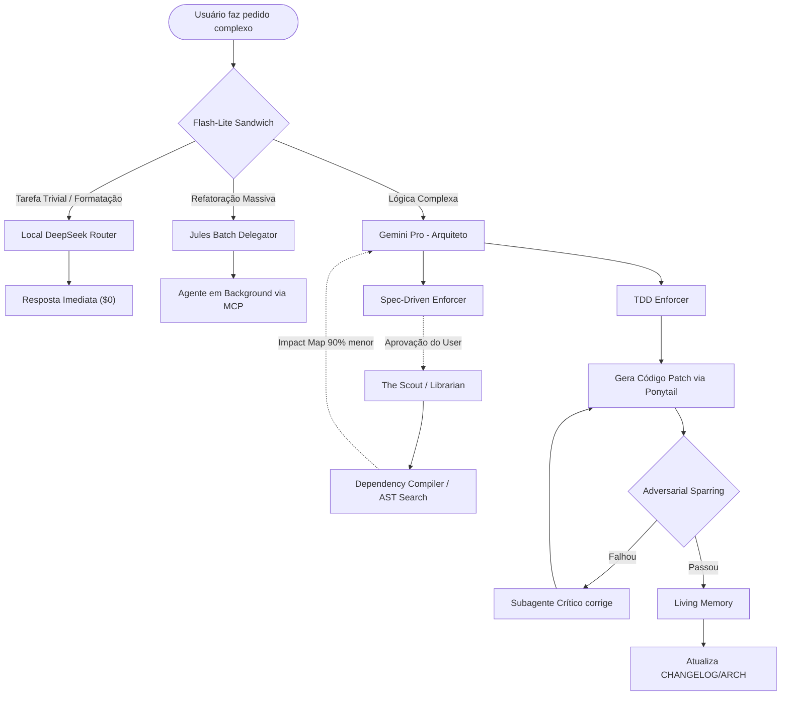

# 🕳️ Event Horizon Skill

<p align="center">
  
</p>

**Event Horizon** é um pacote definitivo de otimização arquitetural e de redução de tokens para agentes de IA (especialmente **Gemini** e o ecossistema **Google Antigravity**). 

Este repositório compila as técnicas mais agressivas de economia de contexto, prevenção de alucinação e delegação assíncrona, transformando um LLM gastão em um engenheiro de software cirúrgico e focado.

---

## 🌳 Arquitetura do Repositório

```text
event-horizon-skill/
├── AGENTS.md                   # Regra Global: O modo "Caveman"
├── bin/                        # Wrappers CLI para compressão de input
│   ├── ast-search              # Extrai apenas assinaturas de funções
│   ├── local-deepseek          # Roteador local para Ollama/DeepSeek
│   └── rtk                     # Rust Token Killer (Bash port) para truncar logs
├── setup.md                    # Guia de instalação e configuração
└── .agents/
    ├── rules/                  # Regras Comportamentais (Sempre ativas)
    │   ├── context-caching.md
    │   ├── flash-lite-sandwich.md
    │   ├── json-optimizer.md
    │   ├── ponytail.md
    │   ├── stateless-relay.md
    │   └── subagent-routing.md
    └── skills/                 # Habilidades Cognitivas (Sob demanda)
        ├── adversarial-sparring/
        ├── commit-summarizer/
        ├── dependency-compiler/
        ├── jules-batch-delegator/
        ├── living-memory/
        ├── log-tailer/
        ├── pre-linter/
        ├── react-protocol/
        ├── schema-dumper/
        ├── scout-librarian/
        ├── spec-driven-enforcer/
        ├── parallel-swarm-orchestrator/
        └── reviewer-council/
```

---

## 🧠 Como Funciona: O Padrão Event Horizon

A filosofia por trás do Event Horizon é simples: **Não pague a IA para fazer trabalho de CPU.**

### 📊 Diagrama de Fluxo (Mermaid)



---

## 📉 As Camadas de Otimização (E como reduzem tokens)

### 1. Camada de Input (Redução de 85% - 95%)
*   **RTK (Rust Token Killer) & Log Tailer:** Em vez de ler `server.log` com 15.000 linhas, o agente passa a ler apenas as 50 linhas críticas onde ocorreu o erro.
*   **AST Search & Dependency Compiler:** Em vez de colar o conteúdo de 10 arquivos importados na memória (~20k tokens), o agente usa regex estrutural para extrair apenas as assinaturas (ex: `function getUser()`), gastando menos de 500 tokens.
*   **Schema Dumper:** Em vez de fazer queries sujas (`SELECT *`), despeja apenas o `pg_dump --schema-only` minificado.

### 2. Camada de Output (Redução de 75% - 85%)
*   **Caveman Mode (`AGENTS.md`):** Proíbe o agente de ser educado. Zero "Aqui está o seu código", zero desculpas, zero explicações não solicitadas. Apenas o código.
*   **Ponytail Mode:** Proíbe reescrever o arquivo inteiro. Força o uso de `replace_file_content` para alterar apenas as 3 linhas necessárias.
*   **Pre-Linter:** Proíbe o modelo de gastar tokens "arrumando" a indentação do código. O modelo foca na lógica e roda o `prettier` ou `eslint` localmente no terminal para cuidar da estética.

### 3. Camada de Cognição e Custo (Economia Financeira de até 99%)
*   **Flash-Lite Sandwich:** Roteia tarefas fáceis para o modelo `flash-lite` (que custa centavos) e deixa o modelo `Pro` apenas para arquitetura.
*   **Local DeepSeek Router:** Redireciona regex e parsers JSON simples diretamente para o **Ollama local** rodando `deepseek-coder`. Custo estritamente zero ($0).
*   **Adversarial Sparring & TDD Enforcer:** Evitam que você entre num "Loop de Alucinação". O agente testa a própria hipótese internamente, consertando o erro *antes* de te entregar o código, poupando turnos infinitos de bate-volta na interface.
*   **Jules Batch Delegator:** Conecta com o MCP Server da Jules AI. Refatorações em massa são enviadas para infraestrutura assíncrona, esvaziando o seu terminal imediatamente.

---

[Leia o Guia de Setup (setup.md) para instalar no seu ambiente local.](./setup.md)
